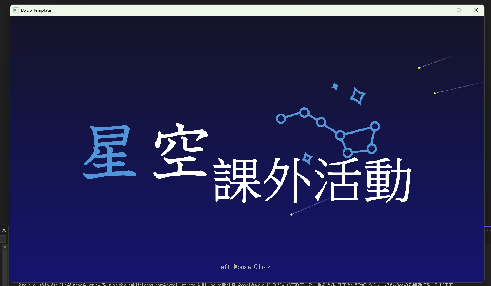
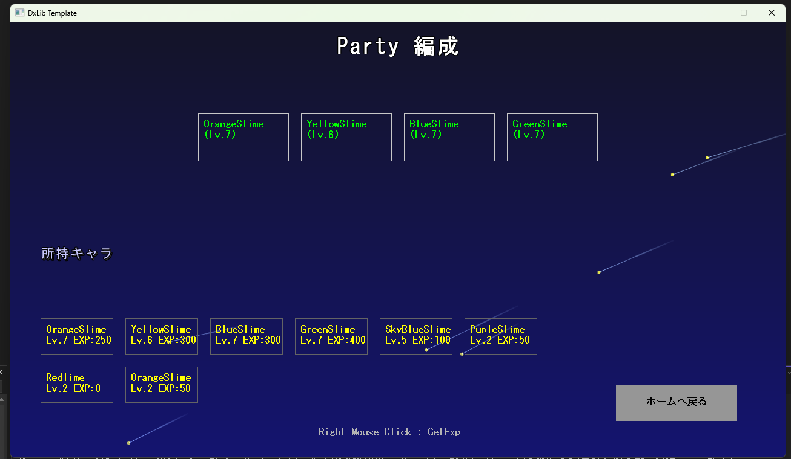
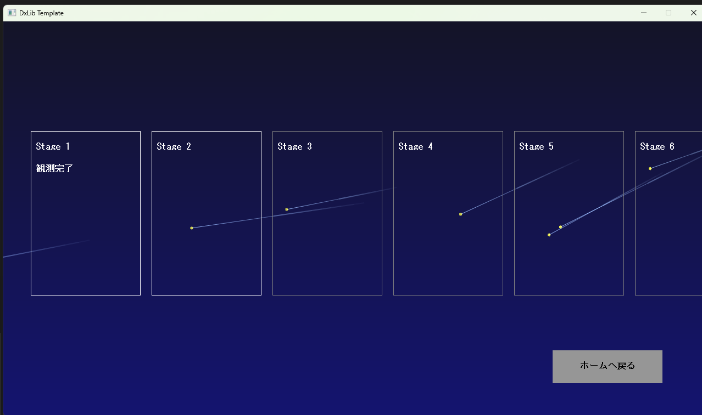
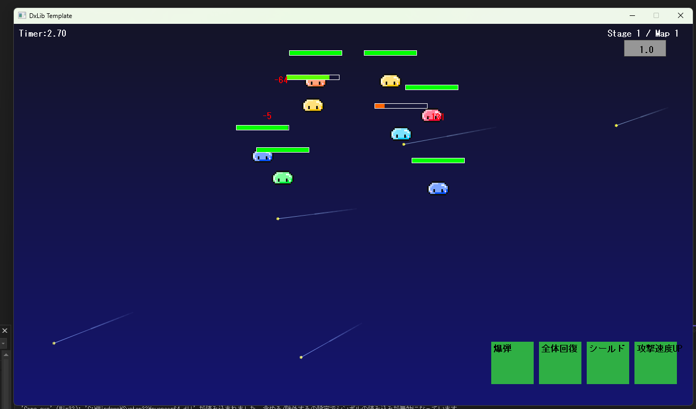
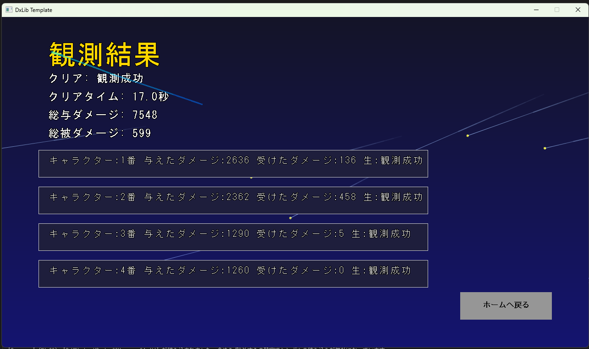

# 作品名
星空課外活動
## 概要

この作品は、２年の前期に授業課題として制作しました。
スマホゲームのようなものを作りたいと考え制作をしました。

---

## 制作時期

* 制作年度：2025年度
* 学期：前期
* 制作期間：2025年4月 ～ 2025年6月

---

## 開発環境

| 項目  | 内容                 |
| --- | ------------------ |
| OS  | Windows 11         |
| 言語  | C++                |
| IDE | Visual Studio 2022 |
---

## 使用ライブラリ・技術

* DXライブラリ
* Git / GitHub

---

## 操作方法

| キー            | 動作    |
| ------------- | ----- |
| 左クリック | 決定    |

---

## 工夫した点・頑張った点

* マウスのエフェクト
* クラスの使用
* データの管理

---

## 苦労した点

* クラスの使用
１年はクラスをあまり使用せず制作をしていました。
ただ、２年からはクラスを使用してゲーム制作していきました。
初めてクラスを使用して作ったゲームです。

---

## 今後の改善点

---

## スクリーンショット

### タイトル画面

### パーティ選択画面

### マップ選択画面

### ゲーム画面

### リザルト画面

